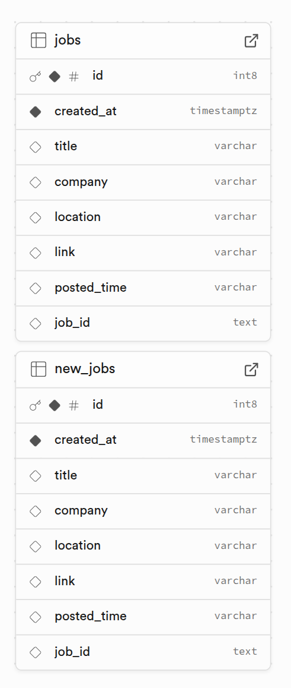
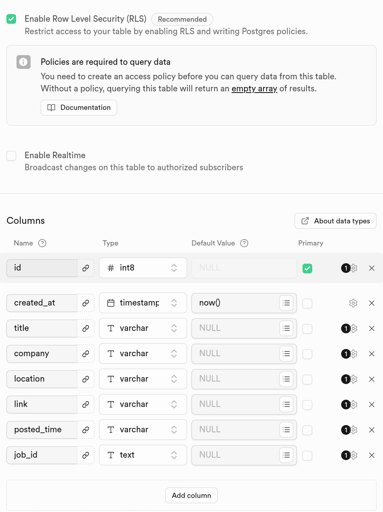
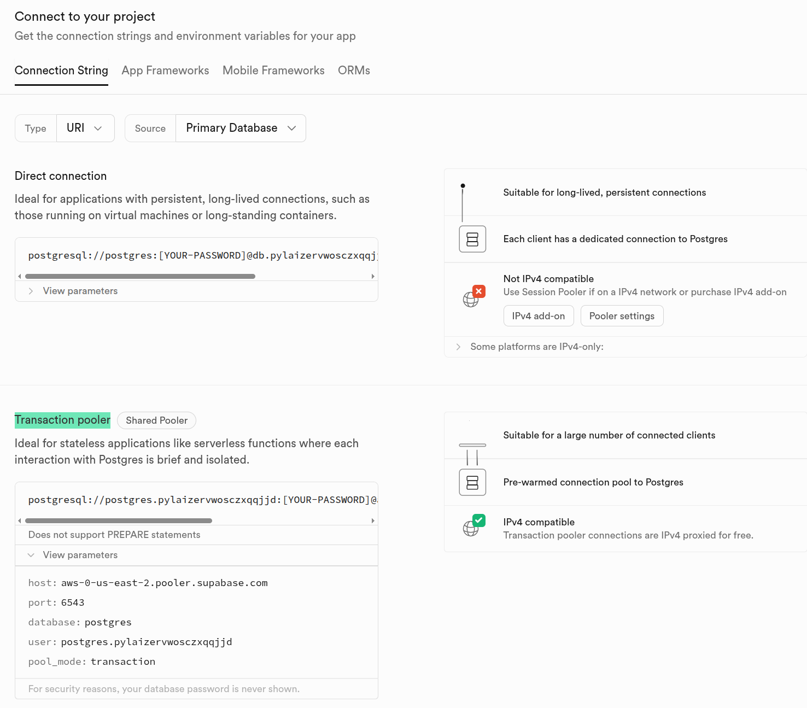

## Automatic Search Jobs from Linkedin

## Prerequisiton
You should run a linux operation system and install Node, npm and git in your computer

**install node and npm**

https://docs.npmjs.com/downloading-and-installing-node-js-and-npm


**install git**

https://github.com/git-guides/install-git


## install this repo and run
1. clone this repo:
   ```bash
   git clone https://github.com/alancj731/linkedinjobsearch.git
   cd linkedinjobsearch
   ```

2. install dependencies:
   ```bash
   npm install
   ```
3. create database in supabase
   -- create your database in supabase and remember the database password  
   -- create an account in supabase.com  
   -- create two tables jobs and newjobs as the following  
     
     

4. get the connection string  
   -- go to database page and click the "Connect" button in the top  
   -- on the opened page find the connection string under the "Connection pooler" section
    


5. set env values:
   ```bash
   cp .env.example .env
   ```
   set USERNAME, PASSWORD, JOB_TITLE, DATE_POSTED values in the env file  
   set DATABASE_URL using the connection string you get from supabase and set the correct password

6. build and run:
   ```bash
   npm run build & npm run start
   # or npm run dev
   ```

7. set alias to run the application (optional)
   ```bash
   ./setalias.sh
   ```
   alias lkinsearch will be added into your ~/.bashrc file, and you can use
   ```bash
   lkinsearch
   ```
   to run the application


